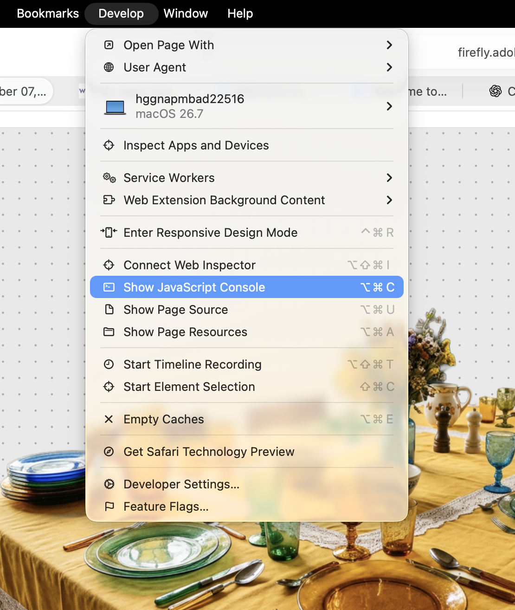
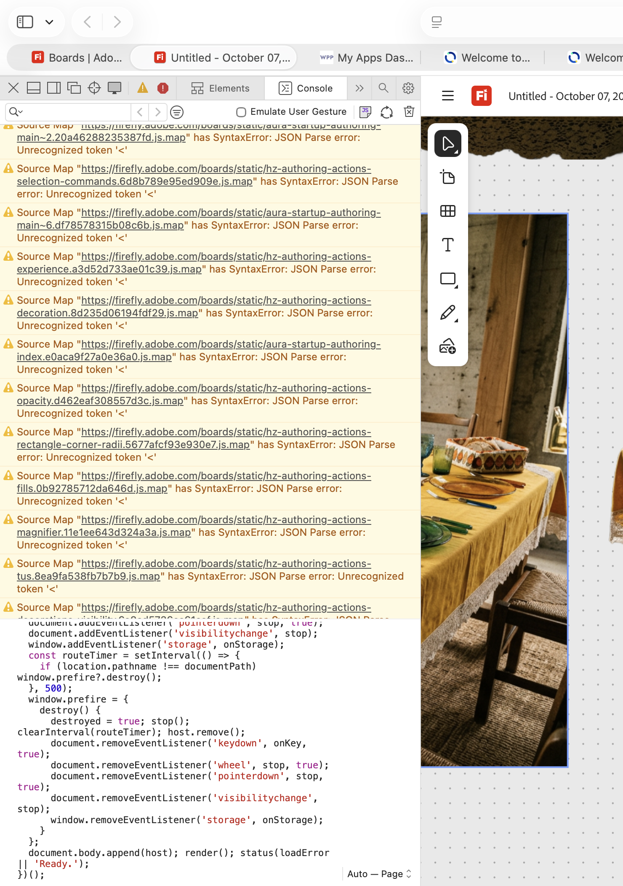
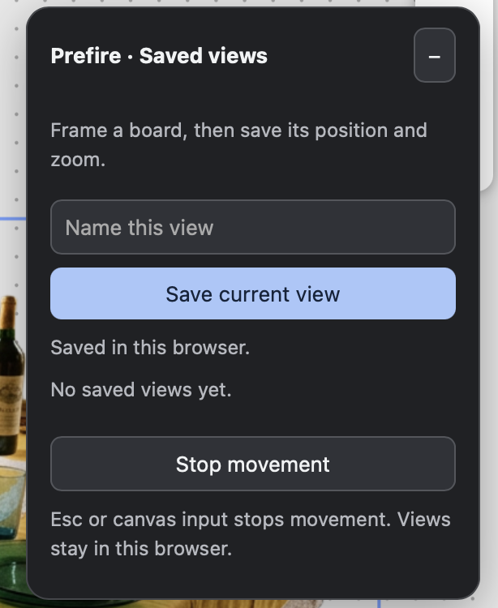

# Prefire

Save views in Adobe Firefly Boards and move smoothly between them. Frame each board once, save its position and zoom, then return with one click.

## Run the console script

No extension installation is needed. Use [prefire-console.js](prefire-console.js) with a Firefly board open.

### Safari

First, enable the **Develop** menu:

1. In Safari, choose **Safari → Settings…** (`Command + ,`).
2. Open the **Advanced** tab.
3. Enable **Show features for web developers**. In older Safari versions, this is called **Show Develop menu in menu bar**.
4. Close Settings. **Develop** now appears in Safari’s menu bar.

Then run the script:

1. Open [prefire-console.js](prefire-console.js), choose **Raw** if viewing it on GitHub, and copy the entire script.
2. Open your board in Firefly and wait for it to load.
3. Choose **Develop → Show JavaScript Console** (`Option + Command + C`).



4. Paste the script into the Console input at the bottom and press **Return**.



5. The **Prefire · Saved views** panel appears over the canvas. You can close the Console and use the panel.



### Chrome

The same [prefire-console.js](prefire-console.js) script works in Chrome; no extension is required.

1. Open [prefire-console.js](prefire-console.js), choose **Raw** if viewing it on GitHub, and copy the entire script.
2. Open your board at **firefly.adobe.com** and wait for it to load.
3. Open **View → Developer → JavaScript Console** on Mac, or **⋮ → More tools → Developer tools → Console**. Keyboard shortcuts: **Option + Command + J** on Mac or **Ctrl + Shift + J** on Windows/Linux.
4. Paste the script into the Console input next to **`>`**, then press **Enter**. Paste only the JavaScript, without Markdown code fences.
5. The **Prefire · Saved views** panel appears over the canvas. Close DevTools, frame a board, enter a name, and click **Save current view**.

If Chrome blocks pasting with a self-XSS warning, review the script first and follow the instructions Chrome displays to enable pasting.

To remove the panel without refreshing, run this in the Console:

```js
window.prefire?.destroy();
```

Removing the panel does not delete saved views.

Rerun the script after refreshing or opening another document. Running it again replaces the existing panel without deleting saved views.

## Use saved views

1. Pan and zoom until a board is framed the way you want.
2. Enter a name and click **Save current view**.
3. Repeat for other boards, then click a saved name to move to that view.

- **Transition:** choose **Smooth** (0.7s), **Gentle** (1.4s with softer starts and stops), **Snappy** (0.35s with a fast start), or **Instant** before clicking a saved view.
- **Reorder:** drag the **⠿** handle. A blue line shows where the view will land. The arrow buttons also move views up or down.
- **Rename:** change a view’s name.
- **Update:** replace a saved view with your current position and zoom.
- **Delete:** remove a saved view after confirmation.
- **Stop:** press **Esc**, interact with the canvas, or click **Stop movement**.
- **Collapse:** click the minus button in the panel header.

Transitions respect your system’s reduced-motion preference. Saved views are camera bookmarks; they do not follow boards that are moved later.

## Where views are saved

The console script saves views locally in this browser, separately for each Firefly document. Refreshing preserves them; clearing Firefly site data removes them. They are not shared with colleagues or synced between browsers. The script does not send data to a server.

To share the tool internally, send colleagues **prefire-console.js** and the instructions above. Each person saves their own views.

## Chrome extension

For automatic loading, use the extension instead:

1. Download [prefire-0.1.0.zip](dist/prefire-0.1.0.zip) and unzip it into a folder you will keep on your computer.
2. Open `chrome://extensions` in Chrome.
3. Enable **Developer mode** in the upper-right corner.
4. Click **Load unpacked** and select the extracted folder containing `manifest.json`. If you downloaded the whole repository instead, select its [extension](extension) folder.
5. Reload Firefly and open a board. The **Prefire · Saved views** panel appears automatically.

To update, replace the files in the installed extension folder with the new version, click **Reload** on Prefire’s card in `chrome://extensions`, and refresh Firefly. Keep the same folder and installation to preserve saved views.

To disable or remove the extension, use its toggle or **Remove** button in `chrome://extensions`.

The extension stores views in local Chrome extension storage. Its saved views are separate from the console script’s, and uninstalling the extension removes them. The extension package is Chrome-only; the console script can be run in Safari as shown above.

To create a distribution ZIP:

```sh
python3 scripts/package.py
```

The ZIP is written to `dist/prefire-0.1.0.zip`. Testers should unzip it and load the extracted folder through **Load unpacked**. Company browser policies may restrict this installation method.

## Troubleshooting

- **Camera not found:** wait for the board to finish loading, then rerun the script.
- **Panel disappears after refresh:** rerun the console script, or use the Chrome extension for automatic loading.
- **Saved view is outdated:** frame the board again and click **Update**.

Prefire uses Firefly’s private camera interface, which Adobe may change at any time. It is independent of Adobe.
